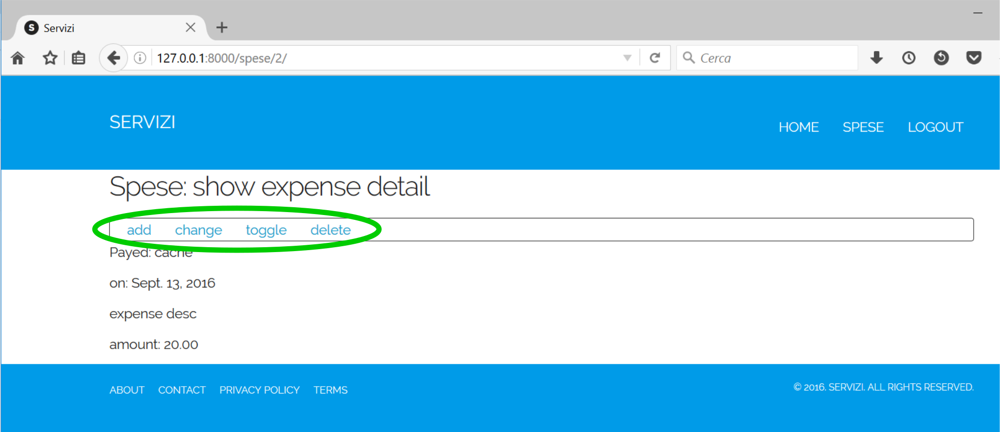
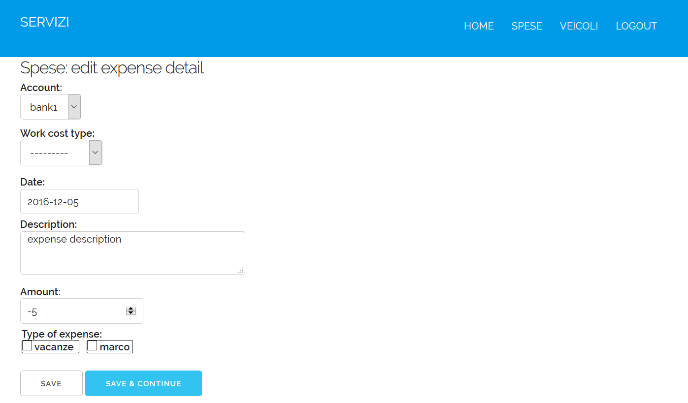

.. _userguide:

User Guide
==========

Here we are going to talk about how use *django-spese* 
to register our personal expenses.

To understand better the available operations, we need
know the base concepts underlining this application.
So first of all we'll talk of `General concepts`_.

Then we'll see the `Administration`_ operations.

And finally we'll see the details about `Using it`_ , where
*it* means the application, of course.

Let's start.

General concepts
----------------

Well, we said *personal* and *expense*. Two terms to think about.

Thinking to *personal* we get 
the **first concept**: every expense *own* someone.

Who is this *one*? The logged user. 

Hence, to use *django-spese* we need login using a ``username``
and a ``password``. When we do it, the application will bind every
new expense to us.

Follow the **second concept**: I, logged user, can add and
work on *my* expenses; but I cannot do something on somebody's else
expenses. Even I cannot see them.

Clarified the *personal* term implications, let's see the 
*expense* term.

An expense means *money* to buy something. Where is money from?

Here we are at the **third concept**: in *django-spese* a source
of money is called  *account*.

An *account* could be a wallet, or a debit card, or a bank account
or something else. Every expense is bound to an *account* from where
money is kept to fulfil it.

As opposed from everyday world, here an *account* hasn't limit:
we can draw from it how much money as we wish. Or add to it.

Add? Yes, add. Why we could not add money instead of remove it?
**Forth concept**: write positive numbers to add money to an *account*, 
and negative numbers to subtract money from it. *django-money*
don't know how to subtract money, it knows only how to add it :)

**Fifth concept**: an *account* is bound to one, or more, *user(s)*.

This means that every *user* could have one or more *account(s)*. But
is also possible an *account* could be **shared** between two or more *users*.
(Yes, I know. This is a very strange concept. Only the few married men can
understand it :-)

**Sixth concept**: every expense could be classified using one or more *tag(s)*.

For example, maybe I wish classify my holidays expenses using the tag
*freetime*, and the work expenses assigning them the *work* tag.

A last concept and we're done. **Seventh concept**: it is possible
tranfer money from one *account* to another. We call this kind of operation:
*tranfer funds*.

Using *transfer funds* we can save time. We could
subtract (remember: use a negative number) from an *account* and add the
same (positive) number to another *account*. But it's a waste
of time and it's even a bit error prone: it isn't so difficult write
one of the two numbers with one more, or less, digit.

And, without *transfer funds*, if we need to change an amount, we must 
remember to change it in two (unrelated) expenses. *transfer funds* 
links the two exepenses, and if we change one, *django-spese* will change
accordly the other.

Since a picture is worth a thousand words, to summarize, please look at
the figure below, which sum up the relationships between the exposed concepts.

As we can see, the most complex relations are between *account* and *user*, and
between *tag* and *expense*. Technically speaking, these are m:n relationships.
Every *account* could belong to more *users* and vice versa. Similarly for *tag*
and *expense*.

The relationships *user / expense* and *source /expense* are much simpler: one *user*
own more *expenses*, not viceversa. So between *source* and *expense*.

Oh, I haven't quoted the *work cost type*. Have I? Please, be patient. Over the
seventh I tend to confuse between ordinals. So ... I explain it now. In case 
you are a professional, may be you wish to register work's expenses.
If so, you can classify this kind of costs assigning an appropriate type.
*WCType* means Work Cost Type and register these types. And *PercentDeduction*
register what percent can be deduct from income tax calculation about a type.

In case you are asking yourself why use records to register a percent deduction associated
to a work cost type, the answer is: time. The percentage can vary on time passing, and
we can register different values on different time intervals. Yes, incoming tax calculation
isn't a simple matter in Italy.

Ok. Now our global knowledge about *django-spese* is complete.
We can start play around.

Administration
--------------

*django-spese* administrators are in charge to supply a simple but complete
environment to application users.

To accomplish this target you use the URI http://127.0.0.1:8000/admin/ and login
using the administrator's username and password.

Base administration window looks as below, without the ellipses:

Red ellipses show the most interesting entities for our duties: 

* *user*,
* *account*,
* *work cost type*,
* *percent deduction*,
* and *tag*.

Green ellipses show the shortcuts to add and change the target records.

User interface is immediate, so I don't explain it in detail. Only, I wish
underline two points.

First. It isn't possible to know an existing user password. We can only
reset it to
a known value. To do so, select *user* entity, from the next users list
select the desidered user, and then use link underlined with red ellipse
in the picture below.

Second. When working on *accounts*, remember: an account could be shared
between different *users*. So the pertinent window looks like below:

Here red ellipse remember us the possibility to bind a single source 
to more users.

It's important bind the source to the correct user, and be aware
to share sources that are truly shared between different users.
I.e. let's to keep again the previous picture. There we have
*cache* shared between *user1* and *user2*. This means that this
two users have the **same cache**: see it as a shared wallet!

If I wish model a situation where *user1* and *user2* have different 
wallets, I must create them (for sake of example let's
say *cache1* and *cache2*) and assign either of them to a single user
(to complete the example: bind *cache1* to *user1* and *cache2* to *user2*).

A last word about *tags*. These are the folders used to classify our expense.
So I urge you to create a tag set limited in size, that fit well with 
your necessities. It's a difficult matter change classification criterions
while running :)

Using it
--------

And now, provided of user's username and password, finally we can login 
visiting http://127.0.0.1:8000/spese/.

Home page welcome us, showing the list of our expenses:

Hereafter we call this window as *home*, even if the true home
is the project home. But we need to focus on our application, 
so we call *home* this one.

In the previous figure we highlight the presence of two different
menues: the project menu and the the *django-spese* menu.

Project menu depends on your project. The previous figure shows 
the one you obtain from the *django-spese* repository. It's
there only as a demo to host our application.

We are concerned about the *django-spese* menu. At *home* we have
two voices:

* *add* adding us a new expense;
* *transfer funds* to realize a transfer of money from one source to another.

If we click on an expense desciption, we'll get its detail:

and from there we can:

* *add*    to insert a new expense (this is the same menu voice from home);
* *change* to edit the expense characteristics;
* *toggle* to change the amount sign of the expense;
* *delete* to remove the expense.

Adding expenses
~~~~~~~~~~~~~~~

At *home*, selecting the *django-spese* menu voice *add* we obtain
a form to input an entirely new expense:

Here we can select the desidered *source*, write the date, description
and amount. And we can choose between the showned tags to categorize
our expense.

When we are done, we can save and return to *home*, using the 
*save* button. Or we can save and add again a new expense, using the
*save & continue* button.

To leave the form without creating a new expense, simply use the 
browser's *back* button, or visit the *home* URL.

Changing expense
~~~~~~~~~~~~~~~~

As we said, at *home*, selecting an expense, we obtain the expense 
*detail* window. 

Here we can choose the *change* menu voice getting 
a form to change the expense characteristics:

In this form we can change whatever we wish. To save changes, we
must push the *save* button, moving us to detail again. Or we can
choose the *save & continue* button, that keep us on the current
change form.

Toggling expense
~~~~~~~~~~~~~~~~

From the *detail* window, we can choose the *toggle* menu voice.

If we hit this voice, the application change the sign of
the amount of the displayed espense.

This action is immediatly shown. We can observe:

* a (hopefully) confirming message after the spese's menu area;
* the new amount of the expense, with the same quantity, but opposite sign.

Deleting expense
~~~~~~~~~~~~~~~~

In the expense *detail* window there is another, very dangerous,
menu voice: *delete*.

As we can imagine, this voice remove the showed expense.

.. warning::  What *you don't know* is that, by now, this operation 
             **don't ask for confirmation**.

             If we choose to delete the current expense this is
             what we *immediatly* obtain.

Transfer funds
~~~~~~~~~~~~~~

At *home*, selecting the *django-spese* menu voice *transfer funds* 
we obtain the shortcut to transfer money from a *source* to
another:

As usual: we must compile the form with the appropiate values. Then
choosing the *save* button we get the desired operation: the *amount*
is subtracted from *tranfer source* and added to *transfer destination*.