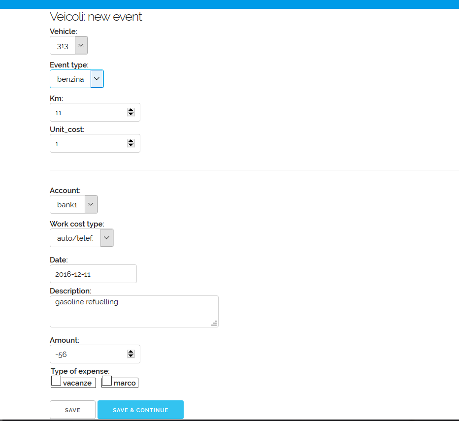

.. _veicoli:

Veicoli
============

From version 0.4+ *django-spese* has an ancillary app: *django-veicoli*.

This is a simple extention to expenses database to record data
specific to vehicles expenses, such:

* what vehicle is about;
* what type of expense (refuelling, maintenance, ...);
* at what distance (km or mi) it happened;
* a unit cost (regarding refuelling, eventually needed to calculate 
  unit consumption).
  
Installation
-------------

When you install *django-spese*, you'll get *django-veicoli* 
installed too.

So, if you need it, you have only to configure it.

In ``setting.py`` of your project, add *django-veicoli* to your ``INSTALLED_APPS``. Like this::

    INSTALLED_APPS = [
        ...
        'veicoli',
    ]
    
Then, include the *django-veicoli* URLconf in your project ``urls.py``. Like this::

    from django.conf.urls import include
    ...
    url(r'^veicoli/', include('veicoli.urls', namespace='veicoli')),

With *django-veicoli* set in your project, when you are going to create the database
you'll get even the *django-veicoli*'s database.

General concepts
----------------

Here we must consider that django-veicoli is a django-spese's
extension.

So the vehicle's expense will be registered in django-spese database.

Becouse now we are senior database analyst :-), we start directly
to show the django-veicoli schema:

We observe:

* every event links to one and only one expense; in expense there is the description, 
  the amount and the other characteristics of the expense we are already accostumed to;
* and every event links to a vehicle and to a type (VEvent).

Administration
--------------

If we have correctly configured our project to use *django-veicoli*, 
when we login to the URI http://127.0.0.1:8000/admin/ 
using the administrator's username and password, the adminstator's home
will show the *django-veicoli* tables too:

From where to fill:

* *VTypes*, for example: car, motorcicle, ...;
* *VEvents*, let's say: gasoline, maintenance, administrative, ...;
* *Vehicles*: the mythical 313, and so on.

Using it
--------

Visiting http://127.0.0.1:8000/veicoli/ we get:

that is vehicle's home page.

It lists all events, regarding the logged user, about
vehicles. Here we can:

* to add a new event using the *add* voice of vehicle menu;
* and to show details about an event with a click on its description.

Adding event
~~~~~~~~~~~~~~~

At vehicle home, selecting the *django-veicoli* menu voice *add* we obtain
a form to input a new event:

This form has two sections.

The first section permits us to select the vehicle, the event type,
the distance (labeled as Kilometer; use the distance unit you prefer,
but be homogeneous)
and the unit cost of the following expense amount.

The second section is about the usual characteristics of an expense.

In fact it is the same windows used to register a new expense.

And even the behaviour of the *save* and *save & continue* buttons are the same.

As usual, to leave the form without creating a new event, use the 
browser's *back* button, or visit the *home* URL.

Displaying event
~~~~~~~~~~~~~~~~

From *home*, clicking on an event description, we obtain its 
*detail* window. 

Here we have two menu voices:

* *new* to create a new event; this is similar to the same voice
  in the vehicle *home* menu;
* *change* to modify the current event.

Changing event
~~~~~~~~~~~~~~~~

If we choose the previous *change* menu voice, we get 
a form to change the event characteristics:

As in case of new event this form has two sections: the first one
specific for vehicle events, and the second for a whatever
expense.

In this form we can change what we wish.

As in case of changing expenses, to save changes, we
must push the *save* button, moving us to detail again. Or we can
choose the *save & continue* button, that keep us on the current
change form.
